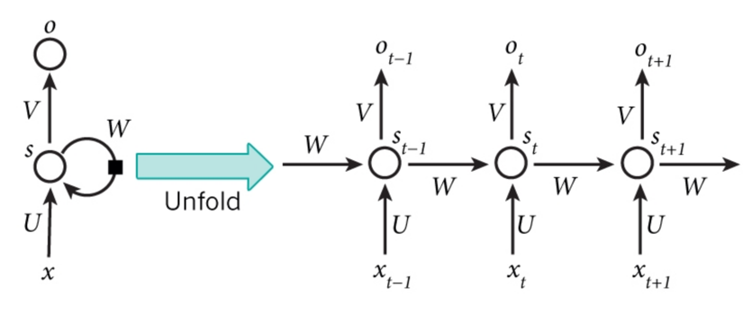
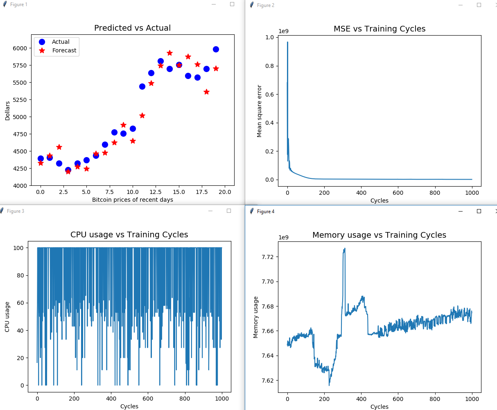
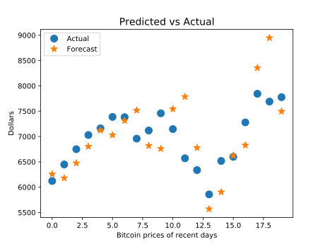
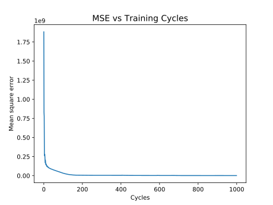
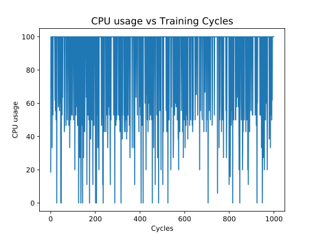
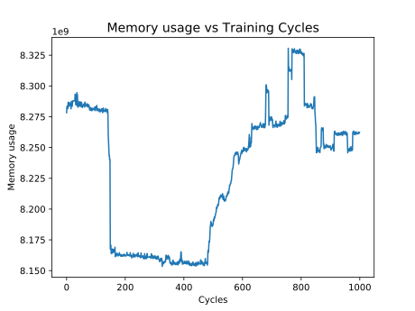
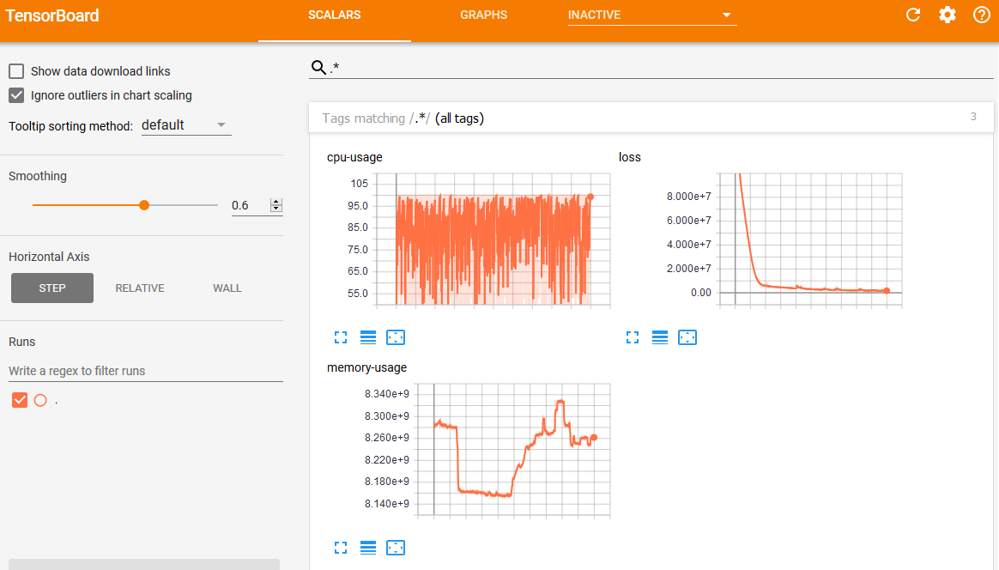
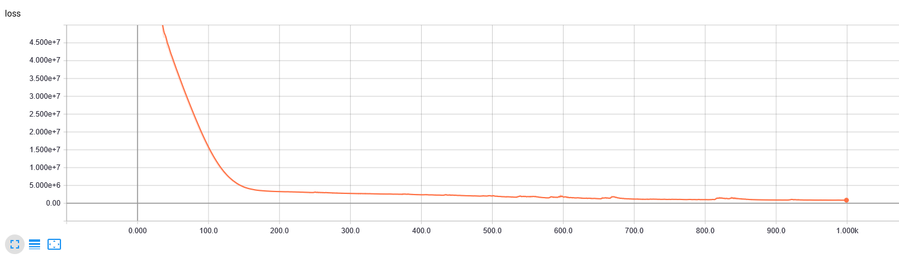
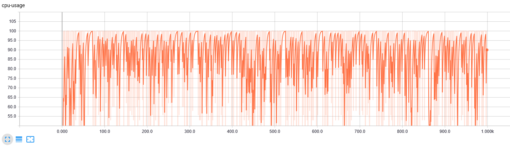

# Bitcoin price predict

This is version 2.0. For previous version, please see [v-1.0](https://github.com/ysmiles/BitcoinPricePredict/tree/v-1.0).

## Content table

1. [New contents](#New-contents)
2. [Introduction](#Introduction)
3. [Implementation](#Implementation)
4. [Output](#Output)
5. [Discusstion and summary](#Discusstion-and-summary)

## New contents

1. Encapsulate a transmitter.
    * Redesign 'datafetch.py' to 'transmitter.py'.
    * The data is from (coindesk.com) and is real and recent data.
    * The working mechanism is same as processing IoT data, although this is somehow not a real IoT application.
    
2. Cloud processing
    * Training and computation can be done at a cloud server (ubuntu 16.04) or locally (windows 10).
    * Data will be stored in a NoSQL database (MongoDB).

3. Receiver
    * Fetch data from NoSQL database and do visualization work.

## Introduction

### Time-series problem

A time series is a series of data points indexed (or listed or graphed) in time order. Most commonly, a time series is a sequence taken at successive equally spaced points in time. Thus it is a sequence of discrete-time data.

1-D time series examples include weather information, stock exchange information, voice information (if we only consider strength or frequency).

Bitcoin price is similar to stocks but may changes more fast.
For example, at the beginning of this month (2017-10-01) it was around **$4400**, and now (2017-10-20) it is almost **$6000**, with the increasing ratio of more than **36%**.
So accurate prediction of future prices of Bitcoin is very attractive.

**Update 2017-11-19: current price is around $7800.**

### Recurrent Neural Networks (RNN)

Recurrent Neural Networks (RNNs) are called recurrent because they perform the same computations for all elements in a sequence of inputs. 

RNNs are good at analyze time series data, such as stock prices, and provide forecasts. 
This is why this homework chose this method.

RNNs can also take sentences, documents, or audio, etc as input, making them extremely useful for natural language processing (NLP) systems, such as automatic translation, speech-to-text, or sentiment analysis.
Overall this method can be applied in many situations where a sequence of data points exists.



This image shows the RNN architecture.

`xt` is the input at time step `t`. For example, in this project `x1` could be the first price of Bitcoin in a specific time period.
`st` is the hidden state at time step `tn` and is calculated based on the previous hidden state and the input at the current step, using an activation function.
`St-1` is usually initialized to zero.
`ot` is the output at step `t`.
For example, if we wanted to predict the next value in a sequence, it would be a vector of probabilities across our time series.

RNN cells are developed on the notion that one input is dependent on the previous input by having a hidden state, or memory, that captures what has been seen so far.
The value of the hidden state at any point in time is a function of the value of the hidden state at the previous time step and the value of the input at the current time step.
In this project, I divide time serial data points as 20 days block. Actually what the whole program do is to finding feature and use 20 days price to predict price of 21st day.

## Implementation

### Installation of Tensorflow

Install Tensorflow at a linux server or desktop is not that hard. Here is a summary of installation bach commands from official guide.

```bash
# for ubuntu
$ sudo apt-get install python3-pip python3-dev python-virtualenv # for Python 3.n
$ virtualenv --system-site-packages -p python3 ~/tensorflow # for Python 3.n
$ source ~/tensorflow/bin/activate # bash, sh, ksh, or zsh
# Assume at least have python 3.5
(tensorflow)$ pip3 install --upgrade tensorflow     # for Python 3.n
```

One note here is to use `virtualenv`, which provide a separated python environment to tensorflow.
The goodness of this is that inside this environment, we do not need to care python or python3, pip or pip3, etc.
In my case, it only has python 3 inside.
Because linux servers always have some python 2 version(s), which is quite annoying for stricting version every time. 
So this `virtualenv` does help.
Just remember to `activate` it as showed above.

I also test this project at Windows 10.
At the beginning I installed it in Anaconda, but it turned out to be with some problems.
So I uninstalled Anaconda and installed official python 3.6 and used native installation with pip.
It worked well.

At Windows system, here is another note.
For some packages, the pip installation requires outside library that generally windows does not have.
To solve this, one could go to following page to download compiled version of packages and then use local pip install.

http://www.lfd.uci.edu/~gohlke/pythonlibs/

### Installation of MongoDB

MongoDB is one of the most popular NoSQL database engine currently. So I plan to use it for data storage. Although the data amount is small, it is a good practice.

[Official guide](https://docs.mongodb.com/v3.6/tutorial/install-mongodb-on-ubuntu/).

Here is a brief summary of installation at Ubuntu 16.04:

```bash
# Import the public key used by the package management system.
sudo apt-key adv --keyserver hkp://keyserver.ubuntu.com:80 --recv 2930ADAE8CAF5059EE73BB4B58712A2291FA4AD5

# Create a list file for MongoDB
echo "deb [ arch=amd64,arm64 ] http://repo.mongodb.org/apt/ubuntu xenial/mongodb-org/testing multiverse" | sudo tee /etc/apt/sources.list.d/mongodb-org-3.6.list

# Reload local package database.
sudo apt-get update

# Install the MongoDB packages.
sudo apt-get install -y mongodb-org

# Start MongoDB.
sudo service mongod start
```

### Data preparation

#### Fetching data

To meet the requirement "load data from remote", there are two basic choices.
One is build a database, insert data, and using some api (say MySQL connector) to fetching data.
The other one is to use some opened/paid and well-defined api to get structured or semi-structured data.

The first one is more practical, but the data source cannot be validated.
I can randomly generate some data and insert it into database, then fetching it to local.
But in this way, it is kind of similar as directly generate data locally.

I chose the latter one, i.e. using an api already exists.

At the beginning, actually I planned to use some weather api doing temperature forecasting.
But the free apis always only provide current data.
The history data is somehow difficult to get.

Luckily, for my planB (this one with Bitcoin), some websites provide good apis with history data. For example, [conindesk](https://coindesk.com).

Python official suggests an api of fetching Bitcoin data.
This package is shown in "exchanges" folder.
It is written for python 2.
I have modified some files to make it compatible with python 3.

The mainly used api function (modified) is as follow:

```python
def get_historical_data_as_dict(cls, start='2017-01-01', end=None):
    if not end:
        end = get_datetime()
    data = cls._get_historical_data(start, end)
    prices = data['bpi']
    # prices = {k: Decimal(str(v)) for (k,v) in prices.items()}
    prices = OrderedDict(sorted(prices.items(), key=lambda t: t[0]))
    return prices
```

`OrderedDict` is used for make the dictionary sorted.
Because I noticed that the return value from original message is not shown as the time order.
For more details, please refer to `coindesk.py` in folder "exchanges".

For easy calling, I wrapped it in `getBCdata` in `datafetch.py`.

```python
def getBCdata(start='2017-01-01', end=None):
    return CoinDesk.get_historical_data_as_dict(start, end)
```

#### Preparation

Preparation can further divide to two small part.

```python
startdate = '2017-01-01'
enddate = '2017-10-20'

rng = pd.date_range(start=startdate, end=enddate, freq='D')
ts = getBCdata(startdate, enddate)
# ts = pd.Series([v for (k, v) in ts.items()])
TS = np.array([v for (k, v) in ts.items()])
```

This part calls predefined api and get data.

```python
num_periods = 20
f_horizon = 1  # forecast horizon, one period into the future

x_data = TS[:(len(TS) - (len(TS) % num_periods))]
x_batches = x_data.reshape(-1, 20, 1)

y_data = TS[1:(len(TS) - (len(TS) % num_periods)) + f_horizon]
y_batches = y_data.reshape(-1, 20, 1)
# print(len(x_batches))
print('x batches shape', x_batches.shape)
# print(x_batches[0:2])
# print(y_batches[0:1])
print('y batches shape', y_batches.shape)


def test_data(series, forecast, num_periods):
    test_x_setup = TS[-(num_periods + forecast):]
    testX = test_x_setup[:num_periods].reshape(-1, 20, 1)
    testY = TS[-(num_periods):].reshape(-1, 20, 1)
    return testX, testY


X_test, Y_test = test_data(TS, f_horizon, num_periods)

print('Test shape', X_test.shape)
# print(X_test)
```

This part parses the data to 20-day blocks and prepare to do training.
Also in this part it chose last 20 days data for testing.
(If the total days mod 20 is not 0, at least some days were not taken as training data, and actually it just predicted one day more).

### Data processing

This part is roughly similar to the RNN example from MapR.

Basically, it did some fundamental setting of Tensorflow session and data.

Training activation function was chosen as "relu".
The mean square error was chosen as the loss function.
The basic AdamOptimizer was used for minimizing loss function result.

For more details please refer the code and comments.

```python
# didn't have any previous graph objects running, but this would reset the graphs
tf.reset_default_graph()

# setted before
# num_periods = 20      #number of periods per vector we are using to predict one period ahead
inputs = 1  # number of vectors submitted
hidden = 500  # number of neurons we will recursively work through, can be changed to improve accuracy
output = 1  # number of output vectors

# create variable objects
X = tf.placeholder(tf.float32, [None, num_periods, inputs])
y = tf.placeholder(tf.float32, [None, num_periods, output])

basic_cell = tf.contrib.rnn.BasicRNNCell(
    num_units=hidden, activation=tf.nn.relu)  # create our RNN object
rnn_output, states = tf.nn.dynamic_rnn(
    basic_cell, X, dtype=tf.float32)  # choose dynamic over static

learning_rate = 0.001  # small learning rate so we don't overshoot the minimum

# change the form into a tensor
stacked_rnn_output = tf.reshape(rnn_output, [-1, hidden])
# specify the type of layer (dense)
stacked_outputs = tf.layers.dense(stacked_rnn_output, output)
# shape of results
outputs = tf.reshape(stacked_outputs, [-1, num_periods, output])

# define the cost function which evaluates the quality of our model
loss = tf.reduce_sum(tf.square(outputs - y))
optimizer = tf.train.AdamOptimizer(
    learning_rate=learning_rate)  # gradient descent method
# train the result of the application of the cost_function
training_op = optimizer.minimize(loss)

init = tf.global_variables_initializer()  # initialize all the variables

epochs = 2000  # number of iterations or training cycles, includes both the FeedFoward and Backpropogation

with tf.Session() as sess:
    init.run()
    for ep in range(epochs):
        sess.run(training_op, feed_dict={X: x_batches, y: y_batches})
```

The testing of (with last 20 days results) is quite easy.
To get predicted data:

```python 
    y_pred = sess.run(outputs, feed_dict={X: X_test})
```

### Result storage

This part involves the way to use MongoDB to store my training and testing results.

At 'bitcoinPredict.py', the following is used for storing data into MongoDB.

```python
# database client
client = MongoClient()

# will saved processed data into this database collection
collection = client.bitcoin_predict.parameters

# remove old parameters
collection.remove()

collection.insert_many([
    {
        'name': 'Y_test',
        'val': Y_test.tolist()
    },
    {
        'name': 'y_pred',
        'val': y_pred.tolist()
    },
    {
        'name': 'epochs',
        'val': epochs.tolist()
    },
    {
        'name': 'mses',
        'val': mses.tolist()
    },
    {
        'name': 'cpus',
        'val': cpus.tolist()
    },
    {
        'name': 'mems',
        'val': mems.tolist()
    },
])
```

At 'receiver.py', the following is used for fetching those data.

```python
# database client
client = MongoClient()
# will fetch data from this collection
collection = client.bitcoin_predict.parameters

# Fetch data
Y_test = np.array(collection.find({'name': 'Y_test'})[0]['val'])
y_pred = np.array(collection.find({'name': 'y_pred'})[0]['val'])
epochs = np.array(collection.find({'name': 'epochs'})[0]['val'])
mses = np.array(collection.find({'name': 'mses'})[0]['val'])
cpus = np.array(collection.find({'name': 'cpus'})[0]['val'])
mems = np.array(collection.find({'name': 'mems'})[0]['val'])
```

Because `collection.find()` will return a `cursor` object, which may contain multiple results of the finding, `[0]` is nessary to get the `val`, since we know the first and only one is our target.

Note that `client` can be connected to another machine if by giving `MongoClient` argument (server address and port, skipped here).

## Output

### Ubuntu server command line output

```bash
(tensorflow) root@ubuntu-2gb-sfo2-01:~/BitcoinPricePredict# python bitcoinPredict.py
x batches shape (16, 20, 1)
y batches shape (16, 20, 1)
Test shape (1, 20, 1)
2017-11-19 18:31:13.584115: I tensorflow/core/platform/cpu_feature_guard.cc:137] Your CPU supports instructions that this TensorFlow binary was not compiled to use: SSE4.1 SSE4.2 AVX AVX2 FMA
100     MSE: 2.05364e+09
200     MSE: 3.94051e+07
300     MSE: 6.28138e+06
400     MSE: 3.75208e+06
500     MSE: 2.9907e+06
600     MSE: 2.63236e+06
700     MSE: 2.04877e+06
800     MSE: 1.69637e+06
900     MSE: 1.61782e+06
1000    MSE: 1.52887e+06
prepare to save data
data saved
```

### Local Windows command line output

```bach
PS C:\Users\Smiles\src\BitcoinPricePredict> python .\bitcoinPredict.py
x batches shape (16, 20, 1)
y batches shape (16, 20, 1)
Test shape (1, 20, 1)
2017-11-19 18:44:19.922752: W C:\tf_jenkins\home\workspace\rel-win\M\windows\PY\36\tensorflow\core\platform\cpu_feature_guard.cc:45] The TensorFlow library wasn't compiled to use AVX instructions, but these are available on your machine and could speed up CPU computations.
2017-11-19 18:44:19.922934: W C:\tf_jenkins\home\workspace\rel-win\M\windows\PY\36\tensorflow\core\platform\cpu_feature_guard.cc:45] The TensorFlow library wasn't compiled to use AVX2 instructions, but these are available on your machine and could speed up CPU computations.
100     MSE: 1.94606e+09
200     MSE: 2.54117e+07
300     MSE: 6.3128e+06
400     MSE: 4.40234e+06
500     MSE: 3.4592e+06
600     MSE: 3.13749e+06
700     MSE: 2.64568e+06
800     MSE: 3.35076e+06
900     MSE: 2.85273e+06
1000    MSE: 1.80416e+06
prepare to save data
data saved
```

### Windows/Linux result

The main output of Windows/Linux platform.

Here we have four images, the test result of last period of days, loss function (mean square error) result, CPU usage, and memory usage.

For discussion of results please refer to last part of this article.

Here are the results in svg images.

<!--  -->
<!--  -->

#### PC/server result


#### loss function


#### cpu usage


#### memory usage


### Web interface

The web interface is implemented with Tensorboard from Tensorflow.

The first screenshot shows the training process, while other images are pretty similar to general PC platform.

For detailed implementation, please refer the code.

#### The training process

<!--  -->


#### Web interface result


Others are similar to previous vector images. So I skipped them here.

<!-- 

 -->

## Discussion and Summary

**(update: 2017-11-19)**

* Usage of NoSQL database
    * This time I think except for the transmitter and receiver, the main improvement is the use of MongoDB. Although at the beginning I met some problems, but it turned out to be very convenient.

* Result discussion
    * We can see the prediction of last 20 prices of recently day looks similar to true value on trend.
    * Overall the loss decrease fast at the beginning but the decreasing rate speed down later at more running cycles.
    * For each data point, it is still not that accurate. MSE also can support this for still keeping at relatively large value.
    * It should not be enough to get profits by this easy model. More optimizations need to be done, not only to increase looping times or the hidden middle layers.
    * CPU usage is normal for training process. I am using an Intel i7-6700K CPU (4 core, 8 hyperthreads) with 16G DDR4 RAM.
    * Memory usage also looks good, running more cycles did not cost much more memory.

* By going through all of those steps, I learned the basics of machine learning steps as well as got to know the working logic of Tensorflow.

* The final visualization adjusting/debugging and documenting costed more time than I expected.

## Reference

https://docs.mongodb.com/

https://en.wikipedia.org/wiki/Time_series

https://medium.com/google-cloud/how-to-do-time-series-prediction-using-rnns-and-tensorflow-and-cloud-ml-engine-2ad2eeb189e8

https://mapr.com/blog/deep-learning-tensorflow/

https://github.com/dursk/bitcoin-price-api